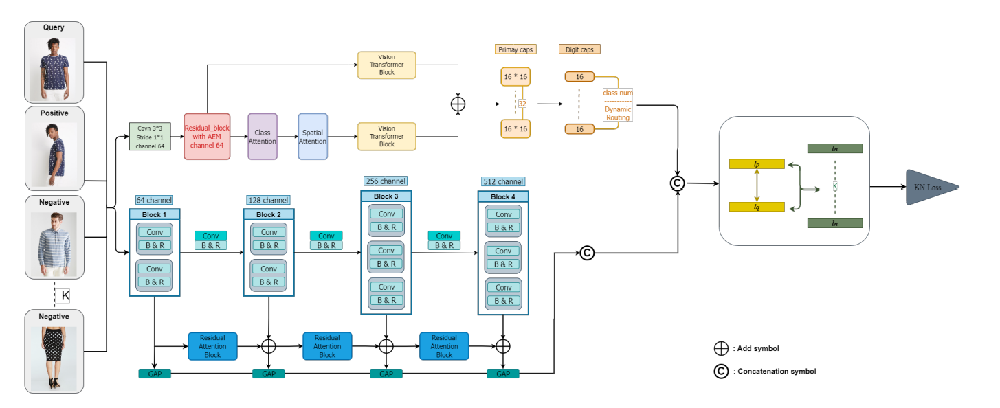

# Clothing Retrieval from Class Aware Attention to Deep Embedding Distance Learning

## Architecture


## Environment Set Up

### Computer Equipment:

* Intel(R) Core(TM) i9-9900KF CPU @ 3.60GHz 3.60 GHz
* 64.0 GB RAM 
* GeForce RTX 2080 Ti with 11GB GPUs
* GeForce RTX 3060 with 12GB GPUs

### Anaconda、Python and Cuda Environment

* Python 3.6
* Tensorflow-gpu = 2.4.1
* Keras = 2.2.4
* Keras-Applications = 1.0.8
* Keras-Preprocessing = 1.1.0
* numpy = 1.19.5
* h5py = 2.10.0
* colorama = 0.4.1
* tqdm = 4.32.1
* cuda v11.1.0
* cudnn v11.1-v8.0.5

### Python file
* blocks = architecture diagram with all internal details(CapsuleNet、Attention、Conv、VGG16、ViT etc.)
* models = summary and concatenate two branches(CapsuleNet、VGG16)
* main = train、test、model
* config = set up batch、input size、classes number、epochs etc.
* layers = groupN、CapsuleNet、ViT
* TripletDirectoryIterator = defined inputs and batches
* utils = loss、learning rate、data_generator、squash activation

### Dataset

The dataset on the local side is divided into Train, Query and Gallery sets. 
Each set contains a category folder, and below it contains a image id folder, and the bottom of the image id folder is the image location.
As shown in below:

mermaid
  Train
      Category 1;
           .
           .
           .
      Category N;
          id_00001
              00001_1.jpg
                   .
                   .
                   .
              00001_x.jpg
              .
              .
              .
          id_xxxxx
              xxxxx_1.jpg
                   .
                   .
                   .
              xxxxx_x.jpg
  Query
    .
    .
    .
  Gallery
 ```

## Run Code
Use terminal 
``` python main.py --filepath <Dataset folder> --save_dir <save folder>```
